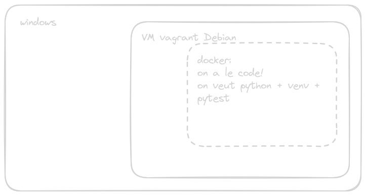

# CICD

## job tests unitaires

### setup python

> dans la VM Debian

```bash
python3 -m venv ~/venv
# activer l'environnement
source ~/venv/bin/activate
pip3 install -r app/requirements.txt
cd app
python3 app.py
```

### setup pytest

1. créer le fichier app/requirements-dev.txt
   * ajouter **pytest** dedans

2. activer l'environnement + `pip3 install -r app/requirements-dev.txt` instaler pytest

3. créer une config pytest: `app/pytest.ini`

```ini
[pytest]
python_files = pytest_*.py
```
4. dans l'environnement: `pytest`

### procédure .gitlb-ci

1. on a besoin d'une image Docker dans laquelle on a python + venv + pytest



### gestion du cache et des rapports

* ajouter un job initial qui génère les dépendance
* mettre les dépendances en cache
* utiliser le cache
* générer le rapport de test en xml au format junit
* le faire remonter dans gitlab pour visu

### ajouter la couverture de code au job de test

* exécuter la couverture de code (avec la paquet idoine)
* porter en gitlab-ci (rapport xml /  % couverture globale)
* exécuter TDD pour faire augmenter la couverture

### qualité avec sonar

* `docker run --name --restart unles-stopped -d -p 9000:9000 sonarqube:lts`

* admin /admin => update

1. config manuelle
   + créer projet + token + python + linux
   + profil qualité attaché au projet
   + gate attachée au projet => métrique "Overall Code" + "coverage + covreage condition"


