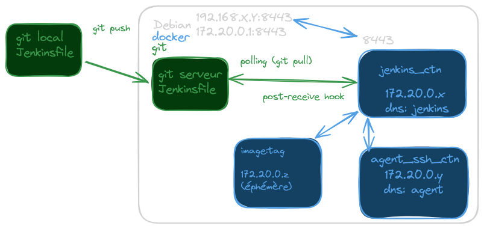

# SETUP JENKINS


## structure

### vM

* VM debian + git + docker + java 17
* stack jenkins avec
   - gestion du TLS (auto signé)
   - extra_hosts car pas de service dns (maquette)
   - http: 8080 https: 8443

### conteneur / image jenkins

* `~/jenkins/compose.yml` gère le lancement de jenkins
```bash
# lancement, dans le dossier contenant compose.yml
docker compose up -d
# arrêt
docker compose down
# checker
docker compose ps
```

* images docker utilisées
  - `docker images`

* troubleshooting dans les conteneurs
  - docker compose exec -it jenkins /bin/bash
  - docker exec -it agent /bin/bash 


## Configurations manuelles

### ajouter des plugins

* procédure:
   - Administrer Jenkins
   - plugins
   - plugins disponibles
     + pipeline
     + git
     + SSH Build Agent

### ajouter l'authentification

* => warning sur l'absence d'authentification
* règlage de sécurité 
  + utiliser la base de données d'utilisateur
  + accès aux fonctionnalités pour les users connectés
  + save
* creer le 1er admin user


## création du projet jenkins

### projet "pipeline"

* Dashboard
  - new item => appelé **java-app**
  - type "pipeline"

* pipeline:
   - défini par Jenkinsfile
   - fichier contenu dans un dépôt git
   - scruté par le projet jenkins

### Configuration GIT du projet

1. [créer un dépôt serveur](./server-git.md) 
2. bypasser la confirmation "known_hosts"
  - *Dashboard > Administrer Jenkins > sécurité*
  - section &#171; Git Host Key Verification Configuration &#187; > **no verification**
3. ajouter un credential
  - *Dashboard > Administrer Jenkins > Credentials > identifiants globaux (illimité)*
  - ssh username et clé 
  - id: git-pkey => arbitraire
  - username: **git** => nom du compte git de la machine
  - contenu: de la clé privée `~/.ssh/jenkins` (côté host)
  - RAPPEL pour la clé pricée: protocole > ed25519 ou ssh-keygen -b 'xxxx' pour augmenter la taille de la clé rsa / ecdsa / ...
  - la passphrase: **roottoor**
4. configurer le projet
  - Dashboard > projet java-app > configurer
  - section &#171; Build Triggers &#187;
    + Scrutation de l'outil de gestion de version
    + *sans planning* car on va utiliser un hook git
  - section &#171; pipeline &#187;
    + definition => **pipeline from SCM**
    + SCM > git
    + URL: git@jenkins.lan:java-app.git (d'où le extra_hosts dans le compose)
    + créer un **credential** (cf infra)

### Scrutation automatique du dépôt (push)
  - *projet > configurer > scrutation automatique du dépôt*
    + version Polling/Pull: **H/4 * * * \*** (un build auto par quart d'heure)
    + version Push: avec un git hook **post-receive** à la fin du git push côté serveur
  - *Dashboard > Administrer Jenkins > sécurité*
    + section &#171; git notifyCommit &#187;
    + création d'un token
    + WARNING: le hook s'utilise dans le cadre d'un WEBHOOK
      * il faudrait un autre token côté git
      * pas de token côté git (contrairement à github/gitlab/...) donc => `-Dhudson.plugins.git.GitStatus.NOTIFY_COMMIT_ACCESS_CONTROL=disabled` dans le conteneur jenkins


## Agent SSH

### problématique

* par défaut, jenkins exécute les jobs dans le conteneur jenkins, en local
* il faut soulager le "noeud manager" qui gère les flux jenkins
* en utilisant un "noeud worker" qui gère la cicd en tant que délégation
* un conteneur adossé au conteneur Jenkins, considérés comme des **Nodes** différents

### construction

* [doc](https://www.jenkins.io/doc/book/using/using-agents/)
1. authentification
  - création des clés SSH => ssh-keygen
  - SOIT un protocole > ed25519 SOIT ssh-keygen -b 'xxxx' pour augmenter la taille de la clé rsa / ecdsa / ...
  - création du Crédential dans Jenkins
2. création du conteneur agent docker
  - en expérimentation
```bash
docker run \
--name=agent -d \
--net jenkins-net \
-e "JENKINS_AGENT_SSH_PUBKEY=<pubkey_content>" \
jenkins/ssh-agent:alpine-jdk17
```
 - ensuite on porte le conteneur en tant que service dans `compose.yml`

3. configuration de l'agent
  - *Dashboard > Administrer Jenkins > Nodes*
    + global sur le scope
    + new node
    + nom: agent
    + rootdir: /home/jenkins (sur le conteneur agent)
    + launch via SSH (cf infra)
  - configuration SSH
    + host: agent -> nom du conteneur = alias réseau sur le réseau interne 172.20.0.0/24
    + credential : jenkins
    + no HOst Key Confirmation


## Agent Docker

1. ajouter les plugins **Docker & Docker pipeline**
> *WARNING: les agents ssh ne peuvent pas utiliser le plugin docker !!!*
> *donc tout stage utilisant un conteneur doit être initier par le manager*
2. les agents ssh doivent être configurés pour être appelés explicitement dans le pipeline
  - *noeud > configurer > utilisation > Réserver ce noeud pour les jobs ...*

3. maintenant, on peut utiliser la drirective `agent { docker }` dans le pipeline

4. le noeud jenkins doit posséder la CLI docker et un accès au démon (socker unix ou tcp) *cf compose.yml*

## SCHEMA COMPLET




## automatisations

### utilisation de la CLI jenkins

* *Dashboard > menu utilisateur > securité*
  - jeton d'API > 119fddeabf44330e5fab0ff369d4bb94ac

```bash
## on the VM
cd ~/jenkins
curl -k -u admin:roottoor https://jenkins.lan:8443/jnlpJars/jenkins-cli.jar -o jenkins-cli.jar

## environment variables to manage calls
# export JENKINS_URL=https://jenkins.lan:8443/
# issue with autosigned cert donc => httpPort in compose &
export JENKINS_URL=http://jenkins.lan:8080/
export JENKINS_USER_ID=admin
export JENKINS_API_TOKEN=119fddeabf44330e5fab0ff369d4bb94ac

java -jar jenkins-cli.jar install-plugin docker-plugin docker-workflow
## to confirm the installs
docker compose restart
```

### plugin Configuration As Code (CASC)

1. ajouter le plugin &#171; Configuration As Code &#187;
2. spécifier la variable `CASC_JENKINS_CONFIG=$JENKINS_HOME/jenkins.yml`
3. éditer le fichier `jenkins.yml`

