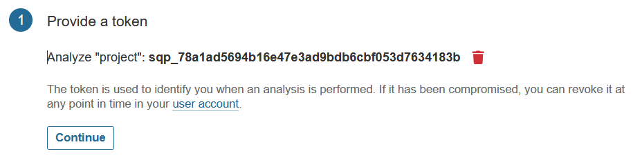

# qualité

## formatter PHP automatisé

* solution : PHP-CS-FIXER
* installation: `composer require --dev friendsofphp/php-cs-fixer`
* configuration: `.php-cs-fixer.dist.php` dans la racine du projet php
* tester: `./vendor/bin/php-cs-fixer fix --config=.php-cs-fixer.dist.php <scope>`
* automatisation via un git hook `pre-commit`

---

## sonarqube: analye SAST avec gitlab

> Static Analysis Security Tests: analyse de code statique 
> Dynamic Analysis Security Tests (DAST : payant) => analyse de conformité
> tests d'intrusion ou pentesting (kali linux + outils python) => CONTRAT

---

### installation d'un serveur

```bash
docker run \
       --name sonar \
       -d --restart unless-stopped \
       -p 9000:9000 \
       --memory 2g \
       sonarqube:lts
```

---

### configuration

1. log: `admin / admin`


2. old/new IDS: `admin / roottoor / roottoor`


3. config manually (self-signed cert !!!)


4. projet: project / project /main


5. config locally (self-signed cert !!!)


6. token: grain de sel + `generate`



7. PHP / Linux


* commande à injecter dans le **job sonar**
```bash
sonar-scanner \
  -Dsonar.projectKey=project \
  -Dsonar.sources=. \
  -Dsonar.host.url=http://gitlab.lan.fr:9000 \
  -Dsonar.login=sqp_ba8fa0a4cf430dc8f0f815db21c5231cc430ef7f
```

---

### profile qualité

1. filtrer sur PHP


2. étendre le profile par défaut en lecture seule, en activant des règles supplémentaires
3. ou copier // , en activant ou désactivant //


4. faire son marché dans le nouveau profile custom 
   + pas de bouton "OK", "Confirmer", "Retour"


5. associer projet <=> profile
   + revenir dans le profile custom & **Change Project**


> à partir de cette étape on peut analyser le projet en regard du profile

6. ajouter une gate custom
   + par défaut une gate est évaluée en face du nouveau code
   + sauf la première fois (code total)
   + créer des conditions sur le code total


7. "unlock editing"
  + ajout couverture code sur tout le code


8. associer la gate <=> projet


* [paramètres](https://docs.sonarsource.com/sonarqube-server/latest/analyzing-source-code/analysis-parameters/)
* [definitions de métriques](https://docs.sonarsource.com/sonarqube-server/9.8/user-guide/metric-definitions/#quality-gates)
* [scope](https://docs.sonarsource.com/sonarqube-server/8.9/project-administration/narrowing-the-focus/)
